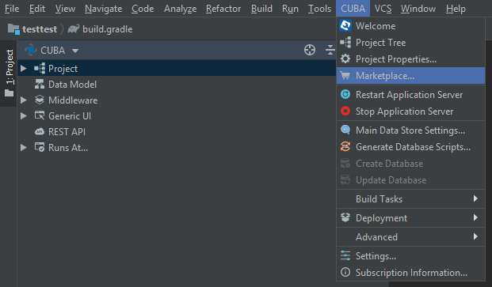

<p>
    <a href="http://www.apache.org/licenses/LICENSE-2.0"></a>
    <a href="https://travis-ci.org/cuba-platform/grapesjs-addon"></a>
</p>

# GrapesJS HTML Editor

- [Overview](#overview)
- [Installation](#installation)
  - [From the Marketplace](#from-the-marketplace)
  - [By Coordinates](#by-coordinates)
- [Usage](#usage)
  - [Adding HTML Editor to the Screen](#adding-html-editor-to-the-screen)
  - [UI Components](#ui-components)
  - [Custom Blocks](#custom-blocks)
  - [User Interface of HTML editor](#user-interface-of-html-editor)
    - [The Blocks Tab](#blocks)
    - [The Style Manager Tab](#the-style-manager-tab)
    - [The Trait Manager Tab](#trait)
    - [The Layers Tab](#layers)
    - [The Top Panel Buttons](#buttons)


# Overview <a name="overview"></a>

The add-on provides a visual HTML editor based on a [GrapesJs](https://grapesjs.com/) JavaScript library with the extensive set of HTML elements. It allows building HTML templates without any knowledge of coding. All you need is to drag an element into the canvas. The wide range of options enables independent styling of any element inside the canvas.

Key features:
- Wide variety of built-in HTML elements.
- Viewing representation for different devices.
- Using CSS properties.
- Downloading/uploading HTML code.


See [sample application](https://github.com/cuba-platform/grapesjs-addon-demo) using this component.

# Installation <a name="installation"></a>

The add-on can be added to your project in one of the ways described below. Installation from the Marketplace is the simplest way. The last version of the add-on compatible with the used version of the platform will be installed.
Also, you can install the add-on by coordinates choosing the required version of the add-on from the table.

In case you want to install the add-on by manual editing or by building from sources see the complete add-ons installation guide in [CUBA Platform documentation](https://doc.cuba-platform.com/manual-latest/manual.html#app_components_usage).

Then, if necessary you can extend an application theme: find *Themes* in the CUBA project tree, right click and go *Manage Themes -> Create Theme Extension*.

## From the Marketplace <a name="from-the-marketplace"></a>

1. Open your application in CUBA Studio. Check the latest version of CUBA Studio on the [CUBA Platform site](https://www.cuba-platform.com/download/previous-studio/).
2. Go to *CUBA -> Marketplace* in the main menu.

 

3. Find the GrapesJS add-on there.

 

4. Click *Install* and apply the changes.
The add-on corresponding to the used platform version will be installed.

## By coordinates <a name="by-coordinates"></a>

1. Open your application in CUBA Studio. Check the latest version of CUBA Studio on the [CUBA Platform site](https://www.cuba-platform.com/download/previous-studio/).
2. Go to *CUBA -> Marketplace* in the main menu.
3. Click the icon in the upper-right corner.

 

4. Paste the add-on coordinates in the corresponding field as follows:

 `com.haulmont.addon.grapesjs:grapesjs-global:<add-on version>`

 where `<add-on version>` is compatible with the used version of the CUBA platform.

 | Platform Version | Add-on Version |
|------------------|----------------|
| 7.2.0.BETA1      | 0.5.0.BETA1    |
| 7.1.x            | 0.4.0          |
| 7.0.x            | 0.2.0          |
| 6.10.x           | 0.1.8          |

5. Click *Install* and apply the changes. The add-on will be installed to your project.


# Usage <a name="usage"></a>

To use the component you need to add HTML editor to the screen. Then add UI components.

## Adding HTML Editor to the Screen <a name="adding-html-editor-to-the-screen"></a>

To use the `GrapesJS` component in your screen, you need to add the special scheme `http://schemas.haulmont.com/grapesjs/ui-component.xsd` in the XML descriptor of the screen and then add a namespace like `grapesjs` for the schema. The schema contains information about the `grapesJsHtmlEditor` tag.

Look at the example of usage:

```xml
<?xml version="1.0" encoding="UTF-8" standalone="no"?>
<window xmlns="http://schemas.haulmont.com/cuba/window.xsd"
        class="com.haulmont.example.web.SomeController"
        xmlns:et="http://schemas.haulmont.com/grapesjs/ui-component.xsd">
    ...
        <et:grapesJsHtmlEditor id="htmlEditor">
            <et:disabledBlocks>
                 //comma separated panel names which should be disabled, for example "map,tabs"
            </et:disabledBlocks>
        </et:grapesJsHtmlEditor>
    ...
```

`grapesjs` UI component provides `setValue(String value)` and `getValue()` methods to set and get HTML content for the component.

## UI Components <a name="ui-components"></a>

After adding HTML editor to the screen you need to add one of the following UI components:

- `grapesJsHtmlEditor` - a base HTML editor without any applied plugins.
- `grapesJsWebpageHtmlEditor` - an HTML editor suitable for webpage development with applied `webpage, customcode` plugins.
- `grapesJsNewsletterHtmlEditor` - an HTML editor suitable for newletter development with applied `newsletter, customcode` plugins.

`grapesJsNewsletterHtmlEditor` component has an additional `inlineCss`. If enabled then CSS classes will be inlined in HTML.

UI components can be extended with plugins using `plugin` tag.
A plugin can be selected from the list of predefined plugins or can be configured as a new plugin.

Default available plugins:
- `basicBlocks` - this plugin contains some basic blocks for the GrapesJS editor ([documentation](https://github.com/artf/grapesjs-blocks-basic)).
- `ckeditor` - this plugin replaces the default Rich Text Editor with the one from CKEditor ([documentation](https://github.com/artf/grapesjs-plugin-ckeditor)).
- `customcode` - this plugin adds a possibility to embed custom code ([documentation](https://github.com/artf/grapesjs-custom-code)).
- `flexBlocks` - this plugin adds the Flexbox block which allows creating easily flexible and responsive columns ([documentation](https://github.com/artf/grapesjs-blocks-flexbox))
- `forms` - this plugin adds some basic form components and blocks to make working with forms easier ([documentation](https://github.com/artf/grapesjs-plugin-forms)).
- `newsletter` - this preset configures GrapesJS to be used as a Newsletter Builder with some unique features and blocks composed specifically for being rendered correctly inside all major email clients ([documentation](https://github.com/artf/grapesjs-preset-newsletter)).
- `postcss` - this plugin enables custom CSS parser via PostCSS ([documentation](https://github.com/artf/grapesjs-parser-postcss)).
- `styleFilter` - add filter type input to the Style Manager in GrapesJS ([documentation](https://github.com/artf/grapesjs-style-filter)).
- `tabs` - simple tabs component plugin for GrapesJS ([documentation](https://github.com/artf/grapesjs-tabs)).
- `tooltip` - simple, CSS only, tooltip component for GrapesJS ([documentation](https://github.com/artf/grapesjs-tooltip)).
- `touch` - this plugin enables touch support for the GrapesJS editor ([documentation](https://github.com/artf/grapesjs-touch))
- `tuiImageEditor` - add the [TOAST UI Image Editor](https://ui.toast.com/tui-image-editor/) on Image Components in GrapesJS ([documentation](https://github.com/artf/grapesjs-tui-image-editor)).
- `webpage` - this preset configures GrapesJS to be used as a Webpage Builder ([plugin documentation](https://github.com/artf/grapesjs-preset-webpage)).

Custom project plugins can be registered via `com.haulmont.addon.grapesjs.web.gui.components.GjsPluginsRepository` class.

Example:
```xml
<et:grapesJsNewsletterHtmlEditor
       id="templateEditor"
       inlineCss="true"
       height="100%" width="100%">
   <et:disabledBlocks>
       map,tabs
    </et:disabledBlocks>
   <et:plugin name="ckeditor">
       <!-- path to plugin configuration-->
       <et:optionsPath>/com/haulmont/addon/grapesjs/web/gui/plugins/gjs-plugin-ckeditor.js</et:optionsPath>
   </et:plugin>
   <et:plugin name="forms"/>
   <et:plugin name="flexBlocks"/>
   <et:plugin name="tuiImageEditor"/>
   <et:plugin name="customcode"/>
   <et:plugin name="postcss"/>
   <et:plugin name="touch">
       <et:options>
           <![CDATA[
               ... custom plugin settings ...
           ]]>
       </et:options>
   </et:plugin>
   <et:plugin name="styleFilter"/>
   <et:plugin>
       <et:name>customPlugin</et:name>
       <et:options>
           <![CDATA[
               ... custom plugin settings ...
           ]]>
       </et:options>
   </et:plugin>
</et:grapesJsNewsletterHtmlEditor>
```

## Custom Blocks <a name="custom-blocks"></a>

Custom blocks can be added to the component using `block` tag with the following parameters:
- *name* - a unique block id.
- *label* - a name of the block.
- *category* - group the block inside a category.
- *content* - HTML content.
- *contentPath* - path to HTML content
- *attributes* - block attributes.

Block example:
```xml
<et:block>
 <et:name>h1-block</et:name>
 <et:label>Heading</et:label>
 <et:category>Basic</et:category>
 <et:content>
   <![CDATA[
           <h1>Put your title here</h1>
       ]]>
 </et:content>
 <et:attributes>
   <![CDATA[
           {
              title: 'Insert h1 block',
              class:'fa fa-th'
           }
       ]]>
 </et:attributes>
</et:block>
```

Custom project blocks can be registered via `com.haulmont.addon.grapesjs.web.gui.components.GjsBlocksRepository` class.
Registered blocks can be added to UI component by `name` attribute. Example `<et:block name="custom block name"/>`.

Please use `class:'fa <fa-icon>'` in block attributes to use Font Awesome icon.

## User Interface of HTML editor <a name="user-interface-of-html-editor"></a>

You can add, set and delete elements from the canvas. In addition, you can import and export HTML and CSS code. Here is a description of setting panels of the editor.

### The Blocks Tab <a name="blocks"></a>

After opening the editor in your project you can see the *Blocks* tab. Set of elements depends on added [UI components](#ui-components). The  following elements can be enabled for adding:

- in the *Basic* section: Columns, Text, Image, Video, Map, Link block, Text section;
- in the *Extra* section: Navbar, Tabs, Custom code;
- in the *Forms* section: Form, Input, Text area, Select, Button, Label, Checkbox, Radio.


### The Style Manager Tab <a name="the-style-manager-tab"></a>

You can set the properties of the elements. Select the element and go to the *Style Manager* tab.


### The Trait Manager Tab <a name="trait"></a>

You can define parameters of an element. Select the element and go to the *Trait Manager* tab.


### The Layers Tab <a name="layers"></a>

To watch the list of elements on the canvas go to the *Layers* tab. You can hide elements on the canvas while editing.


 ### The Top Panel Buttons <a name="buttons"></a>

 The following buttons on the *Top Panel* are available:
- the *Show borders* button
- the *Preview* button
- the *Full-screen* button
- the *Export* button
- the *Undo* button
- the *Redo* button
- the *Import* button
- the *Clear canvas* button

and buttons for changing the screen width.


